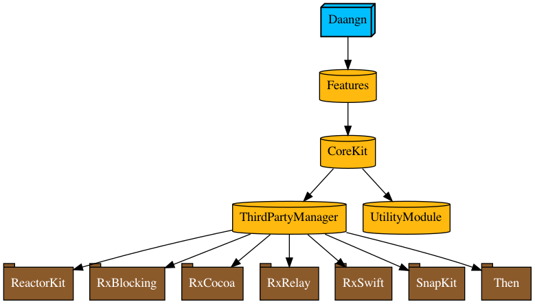

# Daangn
당근마켓 글로벌 프로덕트 iOS 개발자 인턴 사전 과제


### 빌드 요구사항
```
# tuist 설치,,
bash <(curl -Ls https://install.tuist.io)

# 터미널 내에서
tuist generate
```

### 구현사항
- Tuist로 프로젝트 관리
- 모듈화 구조
- Pagination
- 콘텐츠 사이즈에 대응한 Dynamic Height Cell
- 공감하기 뷰 팝업 애니메이션



### 수행기간
- 07.21 (수) 저녁
- 07.22 (목) 저녁
- 07.25 (일) 저녁

